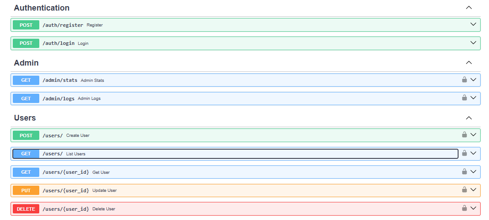
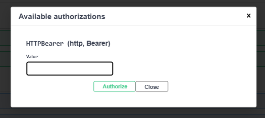
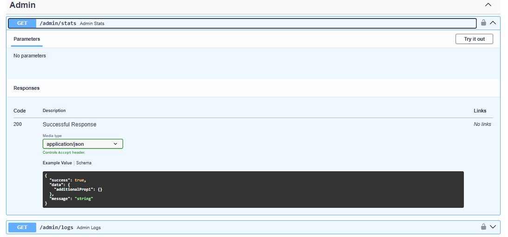

🚀 Backend CRM API – FastAPI (Production Ready)

A production-ready Backend CRM API built with FastAPI, designed for real-world business applications such as CRMs, admin dashboards, SaaS platforms, and internal tools.

This project demonstrates secure authentication, role-based access control, clean architecture, and Dockerized deployment, following industry best practices.

✅ Built for real-world usage — not a demo project

📌 Use Cases

This backend can be used for:

CRM systems
Admin dashboards
SaaS backends
Internal company tools
MVP & startup products
API-first applications

📸 API Screenshots

✨ Key Features

🔐 Authentication & Security

JWT-based authentication
Secure login & signup
Token-protected APIs

👥 Role-Based Access Control (RBAC)

User & Admin roles
Admin-only endpoints
Secure permission checks

🧑‍💻 User Management

Full CRUD operations
Pagination, filtering & sorting
Clean service-layer architecture

🗄️ Database

PostgreSQL
SQLAlchemy ORM
Environment-based configuration

🐳 Dockerized Deployment

Dockerfile + docker-compose
One-command startup
Easy local & server deployment

📘 API Documentation

Swagger / OpenAPI
Interactive API testing
JWT authorization support

🛠 Tech Stack

Backend: Python 3.10, FastAPI
Authentication: JWT (Access Tokens)
Database: PostgreSQL
ORM: SQLAlchemy
Containerization: Docker, Docker Compose
Docs: Swagger / OpenAPI

📂 Project Structure
📂 Project Structure

backend-crm-api/
│
├── app/
│   ├── auth/               # Auth, JWT, RBAC
│   ├── routers/            # API routes
│   ├── services/           # Business logic
│   ├── database/           # DB config & models
│   └── schemas/            # Pydantic schemas
│
├── Dockerfile
├── docker-compose.yml
├── requirements.txt
└── README.md

🚀 Running the Project (Docker)
1️⃣ Clone the repository
git clone https://github.com/shubhangi2441992/backend-crm-api.git
cd backend-crm-api

2️⃣ Start the application
docker compose up --build

3️⃣ Access the API

API: http://localhost:8000

Swagger Docs: http://localhost:8000/docs

🔑 Authentication Flow

Register a user

Login → receive JWT

Authorize via Swagger

Access protected endpoints

🛡️ Admin-Only Endpoints

GET /admin/stats

GET /admin/logs

Only users with role = admin can access these APIs.

🧪 Testing

All APIs are tested using Swagger UI:

Authentication flow

CRUD operations

RBAC enforcement

Dockerized environment

🔧 Customization & Extension

This backend can be easily extended to include:

New user roles

Advanced permissions

Audit logs

Email/SMS integration

Frontend (React / Next.js)

Cloud deployment (AWS, Azure, GCP)

👩‍💻 Author

Shubhangi D.
Python Backend Developer

Skills:
FastAPI • JWT • PostgreSQL • Docker • REST APIs

📩 Available for freelance backend development & API projects